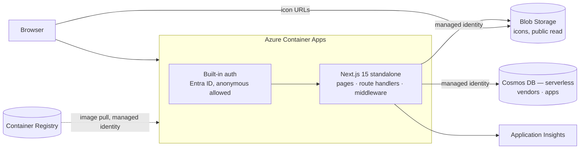

# Architecture

One application, deployed as one container image, plus the Azure resources it
runs on.

All Azure access is by **user-assigned managed identity**, created before
anything that needs it. A system-assigned identity would be created *with* the
container app, which makes its own role assignments circular — the app cannot
pull its image from the registry until a role is granted to a principal that
does not exist until the app is created. `AZURE_CLIENT_ID` on the container
tells `DefaultAzureCredential` which identity to present.



## Why there is no separate API

There was one — an Azure Function App behind Static Web Apps — and it existed
for exactly one reason: the site was a static export, so it had no server of
its own to talk to Cosmos with. The static export was itself forced by SWA's
Next.js hybrid mode ignoring `staticwebapp.config.json`'s routing and role
rules.

Container Apps runs Next.js as a real server, so that chain collapses. Route
Handlers under `app/api/` **are** the backend, in the same process as the pages.
What went with the Function App:

- a second cold start, a second managed identity, a second CI pipeline;
- a network hop on every server-rendered page;
- a type contract across an HTTP boundary that nothing checked. `lib/model.ts`
  is now imported by both the route handlers and the client, and the compiler
  enforces it.

Server-rendered pages do not call their own HTTP API. `app/page.tsx` calls
`summary()` and `app/search/page.tsx` calls `search()` directly. `/api/search`
exists for the browser's type-ahead, which genuinely needs HTTP.

### What "deploy separately" turned into

The original brief asked for the site and backend to deploy independently. With
one service that is no longer literally possible, and Container Apps replaces it
with something that covers the same ground:

**Revisions.** Every deploy creates a new revision. A bad one is a traffic shift
away from undone, and the previous revision is still warm — faster and safer
than reverting a commit and waiting for a rebuild. Path filters still keep
application and infrastructure deploys apart.

If the API ever gets consumers other than this site — a CLI, an MDM
integration — that is the moment to split it back out. All data access sits
behind `lib/server/`, imported only by route handlers and page components, so
extracting it is a move rather than a rewrite.

## Server-side rendering, back again

`output: "standalone"`. Pages are `force-dynamic` and rendered per request from
Cosmos, so the catalogue is in the HTML a crawler receives and there is no
loading shell. The static export was costing SEO on exactly the pages that
would eventually need it; that cost is gone.

Both pages catch a store failure and render a "not answering" state rather than
500ing at someone mid-incident.

## Cosmos DB: two containers, log paths embedded

```
vendors   partition key /id         one document per vendor
apps      partition key /vendorId   one document per app, log paths inside it
```

The account is **serverless**: billing is per request unit consumed rather than
per RU/s reserved. With the catalogue cached in-process for 60 seconds, real
database traffic is a couple of queries per replica per minute, so reserving
capacity around the clock would be paying for idle. Free tier is off — it is
limited to one account per subscription and this subscription's is spent
elsewhere.

Serverless is **immutable after the account is created**. Switching to
provisioned later means a new account and a data migration, so if steady load
ever makes reserved capacity cheaper — or autoscale, multi-region writes or
availability zones become requirements — set `cosmosMode` to `provisioned`
*before* the first deployment. Everything else in the template is unaffected.

**Log paths are embedded, not their own container.** They are always read with
their app, always written with their app, and there are a handful per app. A
separate container would add a query to every read and a distributed write to
every edit, for nothing.

**Vendors are referenced, not embedded.** A vendor's name and icon are shared by
every app it owns; embedding would make a rename touch hundreds of documents.
The join happens in memory, which is free at this size.

**`/vendorId` partitions the apps** because "every app for this vendor" is the
admin portal's main query, and that key makes it single-partition. Search fans
out, which is fine — it is served from cache.

**Slug uniqueness is enforced in code, not by a unique key.** Cosmos unique keys
are scoped to a partition, which does not match what a slug means: on `vendors`
(partitioned by `/id`) every document is alone in its partition, so the
constraint would do nothing; on `apps` it makes a slug unique only within one
vendor. Slugs are URLs, so `lib/server/slugs.ts` checks the whole container on
every write — one query, on a path that writes take and reads never do.

**Moving an app between vendors** changes its partition key, which Cosmos cannot
do in place. `PATCH /api/admin/apps/{id}` with a new `vendorId` does the
create-then-delete; the app keeps its id.

## Icons

`App.iconUrl` is nullable and **null means something**: inherit the vendor's.
The fallback resolves on read (`resolvedIconUrl`), never stored resolved, so
changing a vendor icon updates every app that inherits it with no migration.

Icons live in a public-read blob container on the storage account's own origin.
That is deliberate: an SVG is executable in a browsing context, so serving user
uploads from the site's origin would be a stored-XSS vector. The CSP in
`next.config.mjs` allows `img-src` from `*.blob.core.windows.net` and nothing
else.

## Caching

The catalogue is small, read constantly and written rarely, so each replica
holds all of it for 60 seconds (`lib/server/catalog.ts`). Search then costs no
request units. Admin writes call `invalidate()`, so the writing replica is
immediately correct and the others catch up within the TTL.

Process-local, with no cross-replica invalidation. If editors ever need writes
visible everywhere instantly, the upgrade is the Cosmos change feed pushing an
invalidation — not a shorter TTL.

## Authentication

| Surface | Who gets in | Enforced by |
| --- | --- | --- |
| The site, `/api/search`, `/api/summary`, `/api/vendors`, `/api/apps/{slug}`, `/api/me` | Anyone | Nothing. It is a public reference. |
| `/admin/*` (portal, not yet built) | `admin` role | `middleware.ts` |
| `/api/admin/*` | `admin` role | `middleware.ts`, **and** `requireAdmin()` in each handler |

Container Apps' built-in authentication signs the visitor in with Entra ID and
injects the principal as `x-ms-client-principal`. The platform strips any
client-supplied copy of that header, so what the app reads is what the platform
wrote — unlike the previous design, where the Function App's own public
hostname made the header forgeable. That whole class of hardening problem is
gone with the second service.

`unauthenticatedClientAction` is `AllowAnonymous`, because the catalogue is
public. The middleware decides what the admin surface needs: a signed-in
non-admin gets the `/403` page with a 403; anyone else is redirected to
`/.auth/login/aad`.

**Admin membership is an Entra ID app role.** Assign users or groups to the
`admin` app role on the app registration and it arrives in the token's `roles`
claim. There is no invitation list to keep in sync.

`requireAdmin()` in each handler is defence in depth — a route added under
`/api/admin/` that someone forgets to match in middleware still fails closed.

## Cost

| Resource | Tier | Roughly |
| --- | --- | --- |
| Container Apps | Consumption, 0.5 vCPU / 1 GiB, min 1 replica | ~$12–18/month |
| Container Registry | Basic | ~$5/month |
| Cosmos DB | Serverless | ~$1–3/month at this traffic — billed per request unit |
| Storage | Standard LRS | pennies |
| Application Insights | Pay-as-you-go | $0 under the 5 GB monthly grant |

**Around $20/month, against roughly $9 for the Static Web App it replaces.**
That is the honest price of running a server instead of a CDN. Cosmos is a
rounding error on that, because serverless plus the in-process cache means the
database is barely touched.

`minReplicas: 0` drops it to near zero, at the cost of a cold start of a few
seconds on the first request after idle. It defaults to 1 because this is a tool
people reach for mid-incident, and that is precisely when a cold start is worst.
For a staging environment, set it to 0.

## Known constraints

- **The container app is not created until an image exists.** `containerImage`
  defaults to empty and the app module is conditional on it, so the first
  infrastructure deployment builds everything except the app and `deploy-app`
  creates it once it has pushed an image. There is deliberately no placeholder
  image: one listens on its own port and answers none of our health paths, so
  the app would have to be created with a different ingress port and no probes —
  and `az containerapp update --image` changes neither, which leaves ingress
  pointed at a port nothing serves.
- **`deploy-app` deploys the template, not just the image.** The image is not
  the only thing that has to be right; ingress port, probes, env and identity all
  live in the template, and an image-only update leaves them wherever they were.
  `deploy-infra` reads the currently deployed image back in, so an
  infrastructure-only change never rolls the application back.
- **Cosmos key auth is disabled** (`disableLocalAuth: true`). Everything —
  the app, the seed script, local development — authenticates with Entra ID.
- **Serverless caps a container at 5,000 RU/s and 1 TB.** Both are orders of
  magnitude beyond this catalogue, but they are the ceiling that would force the
  move to provisioned.
- **Probes deliberately do not check Cosmos.** `/api/live` never touches it.
  Restarting or de-rotating the last replica because the database is having a
  bad minute turns a degraded site into a down one, and the pages already handle
  the degraded case. `/api/health` does check the store, and is what the deploy
  workflow gates on.
- **Search ranking lives in `lib/server/catalog.ts`.** The client does no
  scoring.
