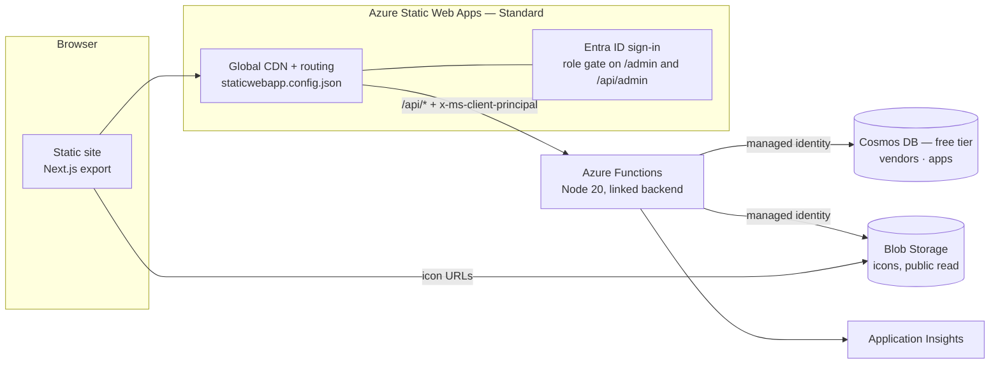

# Architecture

Where Them Logs App is three deployables that ship on their own schedules: a
static site, an HTTP API, and the Azure resources both of them land on.



## The decisions, and what they cost

### Static Web Apps Standard, with a *linked* backend

Standard tier is doing two specific jobs here, not just buying a bigger quota:

1. **Linked backends.** The API is a separately deployed Function App that SWA
   mounts at `/api/*` on the site's own domain. Managed functions — the Free
   tier option — deploy *inside* the site's deployment, which would make
   "deploy the UI without touching the API" impossible. This is the requirement
   that picked the tier.
2. **Role-based route rules.** `staticwebapp.config.json` refuses anonymous
   traffic to `/admin/*` and `/api/admin/*` before it ever reaches a function.

Because SWA proxies, the browser only ever talks to one origin. There is no
CORS configuration in production and no API hostname in the client bundle.

### The site is a static export

`next.config.mjs` sets `output: "export"`. This follows from the linked backend
rather than being a separate preference: SWA's Next.js *hybrid* mode owns
`/api` itself and largely ignores `staticwebapp.config.json`, which would break
both the independent backend and the admin role gating.

**What that costs.** No server-side rendering, so page HTML carries no
catalogue content and the first paint is a shell that then calls `/api`. For a
search tool whose visitors arrive to type a name, that is a fair trade. It
stops being fair the day per-app pages need to rank in search results — at that
point the site moves to Azure Container Apps or App Service running Next.js
properly, and the API stays exactly where it is. The API boundary is what makes
that migration cheap.

### Cosmos DB: two containers, log paths embedded

```
vendors   partition key /id         one document per vendor
apps      partition key /vendorId   one document per app, log paths inside it
```

**Why log paths are embedded, not their own container.** They are always read
with their app, always written with their app, and there are a handful per app.
A separate container would add a query to every read and a distributed write to
every edit, in exchange for nothing. The rule of thumb held: embed what is
bounded and read together.

**Why vendors are referenced, not embedded.** A vendor's name and icon are
shared across every app it owns. Embedding would mean a rename touches hundreds
of documents. The API joins them in memory, which is free at this size.

**Why `/vendorId` partitions the apps.** "Every app for this vendor" is the
admin portal's main query, and that partition key makes it single-partition.
Search fans out across partitions, which is fine: the catalogue is small and
search is served from cache (below).

**Moving an app between vendors** changes its partition key, which Cosmos cannot
do in place. `PATCH /api/admin/apps/{id}` with a new `vendorId` handles it as a
create in the new partition plus a delete from the old one.

### Icons

`Vendor.iconUrl` is required in spirit and nullable in practice.
`App.iconUrl` is nullable and **means something when null**: inherit the
vendor's. The fallback is resolved on read (`resolvedIconUrl` on the API
response), never stored resolved, so changing a vendor icon updates every app
that inherits it without a migration.

Icons live in a public-read blob container on the storage account's own origin.
That is deliberate: an SVG is executable in a browsing context, so serving user
uploads from the site's origin would be a stored-XSS vector. The Content
Security Policy allows `img-src` from `*.blob.core.windows.net` and nothing
else.

### Caching

The catalogue is small, read constantly and written rarely, so each Function
instance holds the whole thing for 60 seconds (`api/src/lib/catalog.ts`).
Search then costs no request units at all. Admin writes call `invalidate()`, so
the writing instance is immediately correct and the others catch up within the
TTL.

This is a process-local cache with no cross-instance invalidation. If editors
ever need writes visible everywhere instantly, the upgrade is the Cosmos change
feed pushing an invalidation — not a shorter TTL.

## Authentication

| Surface | Who gets in | Enforced by |
| --- | --- | --- |
| The site, `/api/search`, `/api/summary`, `/api/vendors`, `/api/apps/{slug}` | Anyone | Nothing. It is a public reference. |
| `/admin/*` (portal, not yet built) | `admin` role | `staticwebapp.config.json` |
| `/api/admin/*` | `admin` role | `staticwebapp.config.json`, **and** `requireAdmin()` in the function |

SWA authenticates with Entra ID and forwards the result to the backend as the
`x-ms-client-principal` header. Every admin handler re-checks it, so a request
that reaches the Function App by some other route still has to carry the role.

Roles come from **SWA invitations** by default — no code, assigned in the portal.
To follow an Entra ID group instead, set `ADMIN_GROUP_IDS` on the Function App
and add `"rolesSource": "/api/roles"` to the `auth` block; `api/src/functions/roles.ts`
is written and waiting.

### Residual hardening, stated plainly

The Function App has a public hostname. Nothing in this template stops someone
calling `https://<func>.azurewebsites.net/api/admin/vendors` directly, and the
only thing refusing them is that they cannot forge `x-ms-client-principal`
without also… simply setting the header. **Before real data goes in, enable
Entra ID authentication (Easy Auth) on the Function App and require it on
`/api/admin/*`.** `docs/DEPLOYMENT.md` has the command. The code-level check is
defence in depth, not the lock.

## Independent deployability

| Workflow | Fires on changes to | Deploys |
| --- | --- | --- |
| `deploy-web.yml` | `app/`, `components/`, `lib/`, `public/`, `staticwebapp.config.json`, `next.config.mjs`, root `package*.json` | Static Web App |
| `deploy-api.yml` | `api/` | Function App |
| `deploy-infra.yml` | `infra/` | Bicep, incremental |

All three trigger on `push` to `main`, which is what a merged PR produces.
`ci.yml` runs on the PR itself and typechecks and builds whichever halves the
branch touched, so a merge never fails at the deploy step.

`deploy-web.yml` also opens a **preview environment** for every PR that touches
the site and tears it down on close — a Standard-tier feature.

The two halves stay independently deployable because the contract between them
is HTTP, versioned by nothing more than care. `lib/api.ts` on the client and
`api/src/lib/model.ts` on the server describe the same shapes and are checked by
neither. That is the one real seam in this design; a breaking API change means
shipping the API first, then the site.

## Cost

| Resource | Tier | Roughly |
| --- | --- | --- |
| Static Web Apps | Standard | ~$9/month |
| Cosmos DB | Free tier | $0 — first 1000 RU/s and 25 GB |
| Functions | Consumption (Y1) | $0 at this volume — 1M free executions |
| Storage | Standard LRS | pennies |
| Application Insights | Pay-as-you-go | $0 under the 5 GB monthly grant |

**Cosmos free tier is one account per Azure subscription.** If the subscription
already has one, `az deployment` fails on the Cosmos resource; set
`cosmosFreeTier: false` in `infra/main.parameters.json` and expect roughly $24/month
for 400 RU/s.

## Known constraints

- **Static Web Apps runs in a handful of regions.** `staticWebAppLocation` is a
  separate parameter from `location` for that reason; the backend may sit
  elsewhere.
- **The Function App's own storage still uses an account key.** On the Y1
  Consumption plan the platform requires `WEBSITE_CONTENTAZUREFILECONNECTIONSTRING`,
  which has no identity-based equivalent. *Application* data — Cosmos and the
  icons container — is keyless. Moving to a Flex Consumption plan removes the
  last key; it was not used here because Y1 has the widest regional coverage.
- **Cosmos key auth is disabled** (`disableLocalAuth: true`). Everything, including
  the seed script and local development, authenticates with Entra ID.
- **Search ranking lives in the API** (`api/src/lib/catalog.ts`). The client does
  no scoring, so ranking changes ship with the backend.
